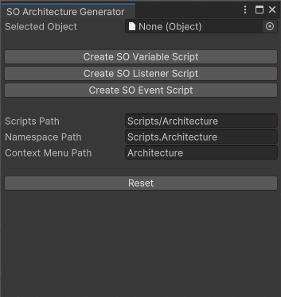

# SH.SOArchitecture

This package is for the Unity engine, which provides an architecture based on ScriptableObjects. It simplifies development of modular and customizable games.

## Features

- **Easy data storage:** Store game data in ScriptableObjects that can be edited at runtime without compiling code.
- **Modular design:** Create modular game components that can be easily combined and reused.
- **Take advantage of reactive programming:** This architecture makes it easy to implement *Event Driven UI* approaches.
- **Work with a wide range of data types:** This package includes ready-to-use ScriptableObjects components for all C# primitive types and supports almost all types serialized by Unity.

## Installation

1. Open the package manager in the Unity engine.
2. Click on the add icon in the upper left corner of the manager and select *Add package from git URL...*.
3. Paste the following link: [https://github.com/SzymonHalucha/SH.SOArchitecture.git](https://github.com/SzymonHalucha/SH.SOArchitecture.git).
4. Click *Add* button.

## Modules in the package

This package has the following modules: Callers, Events, Listeners, ScriptableListeners, Variables.

## Primitive types supported by default

- bool
- byte
- char
- double
- float
- int
- long
- sbyte
- short
- string
- uint
- ulong
- ushort

## Unity Engine types supported by default

- AnimationCurve
- AudioClip
- Color
- Color32
- GameObject
- LayerMask
- UnityEngine.Object
- Quaternion
- Scene
- Vector2
- Vector2Int
- Vector3
- Vector3Int
- Vector4

## Scripts generator

This package has a built-in tool for generating scripts for custom serialized types, created by a programmer. The generator can be found on the Unity engine window toolbar in the Window tab, under the name *SO Architecture Generator*.

## Versioning

We use [SemVer](http://semver.org/) for versioning. For the versions available, see the [branches on this repository](https://github.com/SzymonHalucha/SH.SOArchitecture/branches).

## Authors

- **Szymon Hałucha** - Maintainer

See also the list of [contributors](https://github.com/SzymonHalucha/SH.SOArchitecture/contributors) who participated in this project.

## License

This project is licensed under the MIT License - see the [LICENSE](./LICENSE) file for details.
